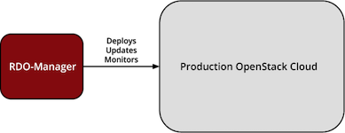
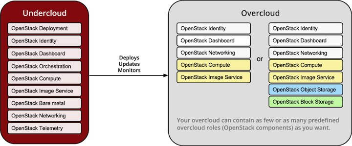
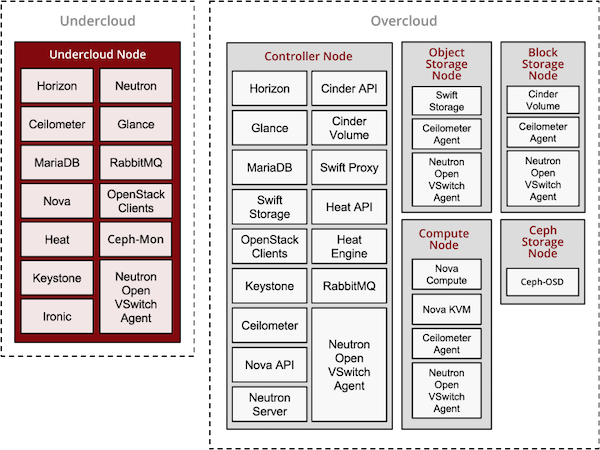
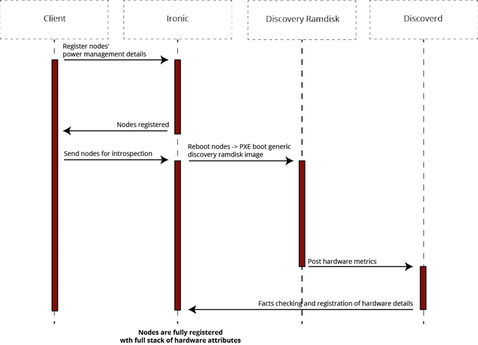

RDO-Manager Architecture
========================

This document lists the main components of RDO-Manager, and gives some
description of how each component is used. There are links to additional sources
of information throughout the document.

.. contents::
   :depth: 3
   :backlinks: none

Architecture Overview
---------------------

RDO-Manager is a community developed approach and set of tools for deploying,
and managing OpenStack cloud which is built upon the `TripleO
<https://wiki.openstack.org/wiki/TripleO>`_ project and its philosophy is
inspired by `SpinalStack <http://spinal-stack.readthedocs.org/en/latest/>`_.

TripleO
^^^^^^^

TripleO is the friendly name for “OpenStack on OpenStack”. It is an official
OpenStack program with the goal of allowing you to deploy and manage a
production cloud onto bare metal hardware using a subset of existing OpenStack
components.

With TripleO, you start by creating an “undercloud” (a deployment cloud)
that will contain the necessary OpenStack components to deploy and manage an
“overcloud” (a workload cloud). The overcloud is the deployed solution
and can represent a cloud for any purpose (e.g. production, staging, test, etc).
The operator can choose any OpenStack components they want for the overcloud.

TripleO leverages several existing core components of OpenStack including Nova,
Neutron, Heat, Glance and Ceilometer to deploy OpenStack on hardware. Nova and
Ironic are used in the undercloud to manage bare metal instances that comprise
the infrastructure for the overcloud. Neutron is utilized to provide a
networking environment in which to deploy the overcloud, machine images are
stored in Glance and Ceilometer collects metrics about your overcloud.

The following diagram illustrates a physical view of how the undercloud may be
hosted on one physical server and the overcloud distributed across many physical
servers.

SpinalStack's Inspiration
^^^^^^^^^^^^^^^^^^^^^^^^^

Some key aspects of SpinalStack workflow have been incorporated into
RDO-Manager, providing options to perform introspection, benchmarking and role
matching of your hardware prior to deploying OpenStack.

Hardware introspection features enable you to collect data about the properties
of your hardware prior to deployment, such that specific classes of hardware may
be matched to specific roles (e.g a special hardware configuration for Compute,
or Storage roles). There is also the option to enable performance benchmarking
during this phase, such that outliers which do not match the expected
performance profile may be excluded from the deployment.

RDO-Manager also configures servers in a similar way to SpinalStack, using
stable community puppet implementations, applied in a series of passes, such
that granular control and validation of the deployment is possible

Benefits
--------

Using RDO-Manager’s combination of OpenStack components, and their APIs, as the
infrastructure to deploy and operate OpenStack itself delivers several benefits:

* RDO-Manager’s APIs are the OpenStack APIs. They’re well maintained, well
  documented, and come with client libraries and command line tools. Users who
  invest time in learning about RDO-Manager’s APIs are also learning about
  OpenStack itself, and users who are already familiar with OpenStack will find
  a great deal in RDO-Manager that they already understand.
* Using the OpenStack components allows more rapid feature development of
  RDO-Manager than might otherwise be the case; RDO-Manager automatically
  inherits all the new features which are added to Glance, Heat etc., even when
  the developer of the new feature didn’t explicitly have TripleO and
  RDO-Manager in mind.
* The same applies to bug fixes and security updates. When OpenStack developers
  fix bugs in the common components, those fixes are inherited by RDO-Manager.
* Users’ can invest time in integrating their own scripts and utilities with
  RDO-Manager’s APIs with some confidence. Those APIs are cooperatively
  maintained and developed by the OpenStack community. They’re not at risk of
  being suddenly changed or retired by a single controlling vendor.
* For developers, tight integration with the openstack APIs provides a solid
  architecture, which has gone through extensive community review.

It should be noted that not everything in RDO-Manager is a reused OpenStack
element. The Tuskar API, for example (which lets users design the workload cloud
that they want to deploy), is found in RDO-Manager but not, so far at least, in
a typical Openstack instance. The Tuskar API is described in more detail below.

Deployment Workflow Overview
----------------------------

#. Environment Preparation

   * Prepare your environemnt (baremetal or virtual)
   * Install undercloud

#. Undercloud Data Preparation

   * Create images to establish the overcloud
   * Register hardware nodes with undercloud
   * Introspect hardware
   * Create flavors (node profiles)

#. Deployment Planning

   * Configure overcloud roles

     * Assign flavor (node profile to match desired hardware specs)
     * Assign image (provisioning image)
     * Size the role (how many instances to deploy)

   * Configure service parameters
   * Create a Heat template describing the overcloud (auto-generated from above)

#. Deployment

   * Use Heat to deploy your template
   * Heat will use Nova to identify and reserve the appropriate nodes
   * Nova will use Ironic to startup nodes and install the correct images

#. Per-node Setup

   * When each node of the overcloud starts it will gather its configuration
     metadata from Heat Template configuration files
   * Hiera files are distributed across all nodes and Heat applies puppet
     manifests to configure the services on the nodes
   * Puppet runs in multiple steps, so that after each step there can be test
     triggered to check progress of the deployment and allow easier debugging.

#. Overcloud Initialization

   * Services on nodes of the overcloud are registered with Keystone

Deployment Workflow Detail
--------------------------

Environment Preparation
^^^^^^^^^^^^^^^^^^^^^^^

In the first place, you need to check that your environment is ready.
RDO-Manager can deploy OpenStack into baremetal as well as virtual environments.
You need to make sure that your environment satisfies minimum requirements for
given environemnt type and that networking is correctly set up.

Next step is to install the undercloud. We install undercloud using `Instack
<https://github.com/rdo-management/instack-undercloud>`_'s script and it calls
puppet scripts in the background. Upstream TripleO developers also use the
developer-based steps known as `devtest <http://docs.openstack.org/developer/
tripleo-incubator/devtest.html>`_.

Undercloud Data Preparation
^^^^^^^^^^^^^^^^^^^^^^^^^^^

Images
""""""

Before deploying the overcloud, you must first download or build images which
will be installed on each of the nodes of the overcloud. TripleO uses
`diskimage-builder <https://github.com/openstack/diskimage-builder>`_ for
building these so called "Golden Images". The diskimage-builder tool takes a
base image e.g. `CentOS 7 <http://cloud.centos.org/centos/7/images/
CentOS-7-x86_64-GenericCloud.qcow2>`_ and then layers additional software via
configuration scripts (called elements) on top of that. The final result is a
qcow2 formatted image with software installed but not configured.

While the diskimage-builder repository provides operating-system specific
elements, ones specific to OpenStack, e.g. nova-api, are found in
`tripleo-image-elements <https://github.com/openstack/tripleo-image-elements>`_.
You can add different elements to an image to provide specific applications and
services. Once all the images required to deploy the overcloud are built, they
are stored in Glance running on the undercloud.

Nodes
"""""

Deploying the overcloud requires suitable hardware. The first task is to
register the available hardware with Ironic, OpenStack’s equivalent of a
hypervisor for managing baremetal servers. User can define the hardware
attributes (such as number of CPUs, RAM, disk) manually or he can leave the
fields out and run introspection of the nodes afterwards.

The sequence of events is pictured below:

* The user, via the GUI, the command-line tools, or through direct API calls,
  registers the power management credentials for a node with Ironic.
* The user then instructs Ironic to reboot the node.
* Because the node is new, and not already fully registered, there are no
  specific PXE-boot instructions for it. In that case, the default action is to
  boot into a discovery ramdisk
* The discovery ramdisk probes the hardware on the node and gathers facts,
  including the number of CPU cores, the local disk size and the amount of RAM.
* The ramdisk posts the facts to the discoverd API.
* All facts are passed and stored in the Ironic databse.
* There can be performed advanced role matching via the ''ahc-match'' tool,
  which simply adds an additional role categorization to Ironic based on
  discovered node facts and specified conditions.

Flavors
"""""""

When users are creating virtual machines (VMs) in an OpenStack cloud, the flavor
that they choose specifies the capacity of the VM which should be created. The
flavor defines the CPU count, the amount of RAM, the amount of disk space etc.
As long as the cloud has enough capacity to grant the user’s wish, and the user
hasn’t reached their quota limit, the flavor acts as a set of instructions on
exactly what kind of VM to create on the user’s behalf.

In the undercloud, where the machines are usually physical rather than virtual
(or, at least, pre-existing, rather than created on demand), flavors have a
slightly different effect. Essentially, they act as a constraint. Of all of the
discovered hardware, only nodes which match a specified flavor are suitable for
a particular role. This can be used to ensure that the large machines with a
great deal of RAM and CPU capacity are used to run Nova in the overcloud, and
the smaller machines run less demanding services, such as Keystone.

The version of TripleO included in RDO-Manager is capable of handling flavors in
two different modes. The simpler PoC (Proof of Concept) mode is intended to
enable new users to experiment, without worrying about matching hardware
profiles. In the mode, there’s one single, global flavor, and any hardware can
match it. That effectively removes flavor matching. Users can use whatever
hardware they wish.

For the second mode, named Scale because it is suited to larger scale overcloud
deployments, flavor matching is in full effect. A node will only be considered
suitable for a given role if the role is associated with a flavor which matches
the capacity of the node. Nodes without a matching flavor are effectively
unusable.

This second mode allows users to ensure that their different hardware types end
up running their intended role, though requires manual configuration of the role
definitions and role matching via the ahc-match tool (see
:doc:`../advanced_deployment/profile_matching`).

Deployment Planning
^^^^^^^^^^^^^^^^^^^

Whole part of planning your deployment is based on concept of **overcloud
roles**.

Roles are stored in the Tuskar DB, and are used through interaction with the
Tuskar API. A role brings together following things:

* An image; the software to be installed on a node
* A flavor; the size of node suited to the role
* A size; number of instances which should be deployed having given role
* A set of heat templates; instructions on how to configure the node for its
  task

In the case of the “Compute” role:

* the image must contain all the required software to boot an OS and then run
  the KVM hypervisor and the Nova compute service
* the flavor (at least for a deployment which isn’t a simple proof of concept),
  should specify that the machine has enough CPU capacity and RAM to host
  several VMs concurrently
* the Heat templates will take care of ensuring that the Nova service is
  correctly configured on each node when it first boots.

Currently, the roles in RDO-Manager are very prescriptive, and in particular
individual services cannot easily be scaled independently of the Controller role
(other than storage nodes). More flexibility in this regard is planned in a
future release.

Customizable things during deployment planning are:
* Number of nodes for each role
* Service parameters configuration
* Network configuration (NIC configuration options, isolated vs. single overlay)
* Ceph rbd backend options and defaults
* Ways to pass in extra configuration, e.g site-specific customzations

Deployment
^^^^^^^^^^

Deployment to physical servers happens through a collaboration of Tuskar, Heat,
Nova, Neutron, Glance and Ironic.

To deploy the overcloud Tuskar needs gather all plan information it keeps and
build a Heat templates which describe desired overcloud.

This template is served to to Heat which will orchestrate the whole deployment
and it will create a stack. Stak is Heat’s own term for the applications that it
creates. The overcloud, in Heat terms, is a particularly complex instance of a
stack.

In order to the stack to be deployed, Heat makes successive calls to Nova,
OpenStack’s compute service controller. Nova depends upon Ironic, which, as
described above has acquired an inventory of discovered hardware by this stage
in the process.

At this point, Nova flavors may act as a constraint, influencing the range of
machines which may be picked for deployment by the Nova scheduler. For each
request to deploy a new node with a specific role, Nova filters the of available
nodes, ensuring that the selected nodes meets the hardware requirements.

Once the target node has been selected, Ironic does the actual provisioning of
the node, Ironic retrieves the OS image associated with the role from Glance,
causes the node to boot a deployment ramdisk and then, in the typical case,
exports the node’s local disk over iSCSI so that the disk can be partitioned and
the have the OS image written onto it by the Ironic Conductor.

See Ironic’s `Understanding Baremetal Deployment <http://docs.openstack.org/
developer/ironic/deploy/user-guide.html#understanding-bare-metal-deployment>`_
for further details.

Per-node Setup
^^^^^^^^^^^^^^

TBD - Puppet

Overcloud Initialization
^^^^^^^^^^^^^^^^^^^^^^^^

After the overcloud has been deployed, the initialization of OpenStack services
(e.g Keystone, Neutron, etc) needs to occur. That is accomplished today by
scripts in the `tripleo-incubator <https://github.com/openstack/
tripleo-incubator>`_ source repository and it uses bits from `os-cloud-config
<https://github.com/openstack/os-cloud-config>`_ which contains common code,
the seed initialisation logic, and the post heat completion initial
configuration of a cloud. There are three primary steps to completing the
initialization:

* Initializing Identity Services (Keystone)
* Registering service endpoints (e.g. Glance, Nova)
* Specify a block of IP addresses for overcloud instances (Neutron)

The first step initializes Keystone for use with normal authentication by
creating the admin and service tenants, the admin and Member roles, the admin
user, configure certificates and finally registers the initial identity
endpoint. The next step registers image, orchestration, network and compute
services running on the default ports on the controlplane node. Finally, Neutron
is given a starting IP address, ending IP address, and a CIDR notation to
represent the subnet for the block of floating IP addresses that will be used
within the overcloud.

High Availability (HA)
----------------------

RDO-Manager will use Pacemaker to achieve high-availability.

Reference architecture document: https://github.com/beekhof/osp-ha-deploy

.. note:: **Current HA solution is being developed by our community.**

Managing the Deployment
-----------------------

After the overcloud deployment is completed, it will be possible to monitor,
scale it out or perform basic maintenance operations via GUI or CLI.

Monitoring the Overcloud
^^^^^^^^^^^^^^^^^^^^^^^^

When the overcloud is deployed, Ceilometer can be configured to track a set of
OS metrics for each node (system load, CPU utiization, swap usage etc.) These
metrics are graphed in the GUI, both for individual nodes, and for groups
of nodes, such as the collection of nodes which are all delivering a particular
role.

Additionally, Ironic exports IPMI metrics for nodes, which can also be stored in
Ceilometer. This enables checks on hardware state such as fan operation/failure
and internal chassis temperatures.

The metrics which Ceilometer gathers can be queried for Ceilometer's REST API,
or by using the command line client.

.. Note::
   There are plans to add more operational tooling to the future release.

Scaling-out the Overcloud
^^^^^^^^^^^^^^^^^^^^^^^^^

The process of scaling out the overcloud by adding new nodes involves these
stages:

* Making sure you have enough nodes to deploy on (or register new nodes as
  described in the "Undercloud Data Preparation" section above).
* Updating the plan managed by Tuskar, as described in the “Deployment Planning"
  section above.
* Calling Heat to update the stack which will apply the set of changes to the
  overcloud.
