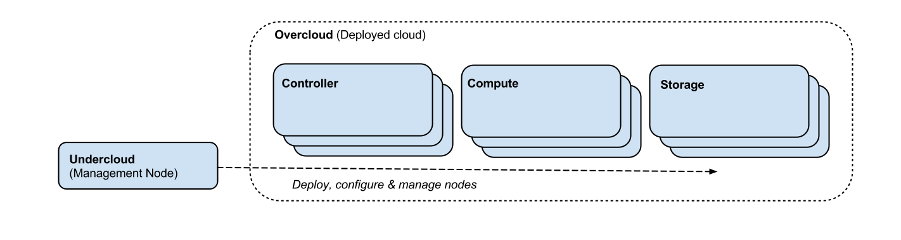

RDO-Manager Introduction
========================

RDO-Manager is an OpenStack Deployment & Management tool for RDO. It is based on
`OpenStack TripleO <https://wiki.openstack.org/wiki/TripleO>`_ project and its
philosophy is inspired by `SpinalStack <http://spinal-stack.readthedocs.org/en/
latest/>`_.

The tooling allows you to deploy a management node ("undercloud") which contains
the services required to then deploy your OpenStack environment ("overcloud")

RDO manager provides semi-automated configuration of your undercloud
environment, after which it is possible to deploy an overcloud containing your
desired number of overcloud resource nodes (using either UI or CLI interfaces).

Overcloud resource nodes may be independently scaled, and support exists for the following roles:

Controller
    The Controller nodes contain the OpenStack API services and associated dependencies.

Compute
    The Compute nodes contain the Nova compute (hypervisor) components.

Storage
    Optional Storage roles exist which allow you to scale Ceph, Swift or LVM based Cinder storage independently of the controller.

Useful links:

* `RDO-Manager Home Page <http://rdoproject.org/RDO-Manager>`_

* `RDO-Manager Repositories <http://github.com/rdo-management>`_

* `TripleO Documentation <http://docs.openstack.org/developer/tripleo-incubator/README.html>`_.

* :doc:`components`

.. toctree::
   :hidden:

   Architecture <architecture>
   Components <components>
